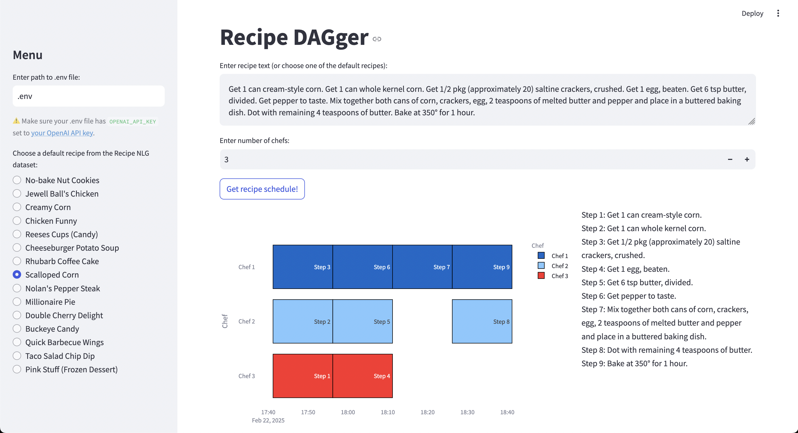

# Recipe DAGger

Inputs: 
- Recipe
  - [ ] Link to any recipe page
  - [x] A default recipe from the [recipe_nlg_hf_data](https://huggingface.co/datasets/mbien/recipe_nlg)
- [x] Number of chefs 

Outputs: 
- [x] Sequence of recipe steps for each chef that can be run in parallel
- [x] Gantt chart to visualize the output above

Method:
- [ ] Parse the recipe webpage for the recipe text
- [x] Use an LLM to convert the recipe text to a DAG 
  - [x] Come up with a prompt for [recipe_nlg_hf_data](https://huggingface.co/datasets/mbien/recipe_nlg) which already has well-formatted recipe text
  - [ ] If needed, manually create a few bootstrapping samples and use DSPY
- [x] Use Coffman–Graham algorithm on the DAG for task scheduling
- [x] Use Streamlit for the UI